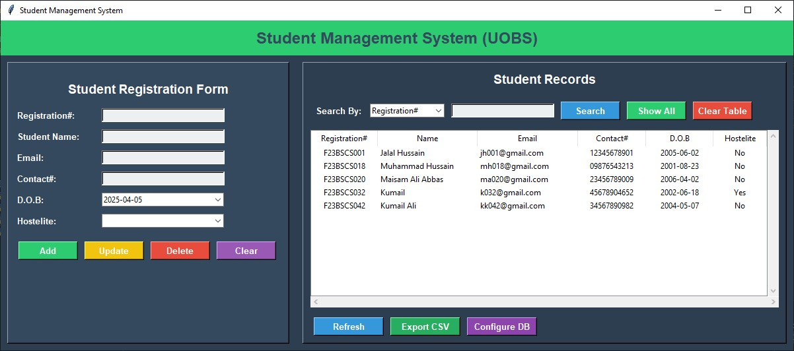

# Student Management System (SMS)



A Python-based GUI application for managing student records with MySQL database integration.

## Project Structure

SMS/
├── models/       # Database operations
│   └── database.py
├── views/        # GUI components
│   ├── form.py   # Student form
│   ├── table.py  # Records table
│   └── main_window.py # Main application window
├── constants.py  # Theme configuration
├── config.ini    # Database configuration
└── main.py       # Entry point

## Features

- **Student CRUD Operations**:
  - Add new student records
  - Update existing records
  - Delete students
  - Clear form fields

- **Advanced Search**:
  - Search by Registration#, Name, Email, Contact#, or D.O.B
  - Partial matching for text fields
  - Exact date matching for D.O.B

- **Data Management**:
  - Export records to CSV
  - Clear entire table (with confirmation)
  - Refresh table view

- **Database Configuration**:
  - Configurable connection settings
  - Automatic database creation
  - Secure credential storage

## Technology Stack

- **Frontend**: Tkinter GUI
- **Backend**: MySQL
- **Python Packages**:
  - `mysql-connector-python`
  - `tkcalendar`
  - `configparser`
  - `babel`
  - `pip`
  - `datetime`

## Installation

### Prerequisites

1. Python 3.8+
2. MySQL Server 8.0+
3. Git (optional)

### Setup

```bash
# Clone repository
git clone https://github.com/yourusername/student-management-system.git
cd student-management-system

# Create virtual environment (recommended)
python -m venv venv
source venv/bin/activate  # On Windows: venv\Scripts\activate

# Install dependencies
pip install -r requirements.txt

# Database Configuration
 - Create a MySQL user with appropriate privileges
 - Edit config.ini:
    [DATABASE]
    host = localhost
    user = your_username
    password = your_password
    database = uobs

# Usage
    python main.py

# Database Schema
CREATE TABLE students (
    RegistrationNo VARCHAR(20) PRIMARY KEY,
    Name VARCHAR(50) NOT NULL,
    Email VARCHAR(50),
    Contact VARCHAR(15),
    DOB DATE,
    Hostelite VARCHAR(5)
);

# Theme Configuration
Colors are defined in constants.py:

THEME = {
    "bg_color": "#2C3E50",        // Dark blue background
    "frame_color": "#34495E",     // Slightly lighter blue for frames
    "text_color": "white",        // White text
    "button_color": "#3498DB",    // Blue buttons
    "error_color": "#E74C3C",     // Red for errors
    "success_color": "#2ECC71",    // Green for success
    "warning_color": "#F1C40F",   // Yellow for warnings
    "other_color": "#9B59B6"      // Purple for miscellaneous
}

# Troubleshooting

Common Issues
    1. MySQL Connection Errors:

        - Verify MySQL service is running
        - Check credentials in config.ini
        - Ensure user has proper privileges

    2. Import Errors:

        - Run from project root directory
        - Ensure all __init__.py files exist
        - Verify Python path includes project directory

    3. Date Format Issues:

        - Use YYYY-MM-DD format for dates
        - Ensure system locale settings match
